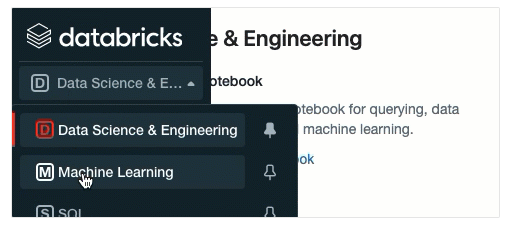
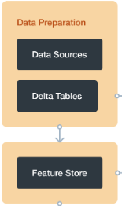
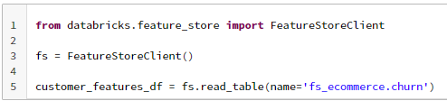
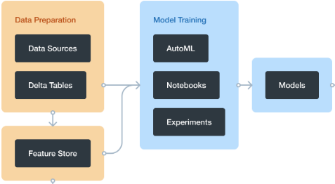
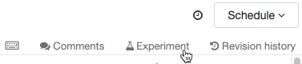
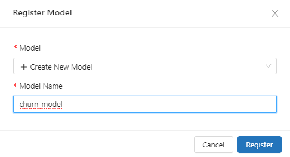
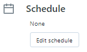
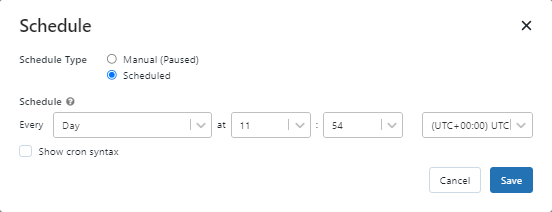

# Churn Prediction E2E with Azure Databricks

### Documentação Funcional

Autores: Matheus Gonzalez Eugênio, Engenheiro de Machine Learning - Blueshift

### Sumário

[1 - Objetivo](#_83e42hv72w7i)

[2 - Ambiente](#_pb47rk05j0)

[2.a - Seleção da persona](#_x37zjox609hb)

[2.b - Configuração do cluster para ciência de dados](#_dfsbujmuihyq)

[3 - Preparação dos dados](#_n4ismeqppazm)

[3.a - Feature Store](#_9yz3kzs76wkr)

[3.a.1 - Criar um banco de dados para a feature table](#_iuv6nckh7o62)

[3.a.2 - Criar uma feature table](#_v6k7anhfmt3b)

[4 - Treinamento de modelos](#_j9t4ukaqrba9)

[4.a - AutoML](#_nwow60zm89c)

[4.b - Rastreamento dos experimentos](#_eryz4615bzh7)

[4.c - Deploy](#_4c2u3g1s1v)

[5 - Inferência](#_i9bn97yb6ppt)

[6 - Workflows](#_4qlrm88n279c)

[7 - Monitoramento](#_z0c6x3gsuuvq)

---

#### 1 - Objetivo
Esse documento tem como objetivo apresentar a arquitetura dos processos de MLOps para integração das etapas de feature engineering, treino, deploy e monitoramento dos modelo de machine learning utilizando a plataforma Databricks.

#### 2 - Ambiente
Neste tópico você encontrará informações sobre os primeiros passos necessários para começar a utilizar o Databricks como cientista de dados.

#### 2.a - Seleção da persona
Os recursos disponíveis na barra lateral dependem da persona selecionada, sendo elas: **Data Science & Engineering**, **Machine Learning** ou **SQL**. Para que você possa utilizar todos os recursos detalhados abaixo, orientamos a seleção da persona **Machine Learning**.

#### 2.b - Configuração do cluster para ciência de dados
Um cluster é uma coleção de recursos de computação do Databricks. Para criar um cluster:

1. Na barra lateral, clique em **Compute**
1. Ao acessar a página, clique em **Create Cluster**
1. Na página **Create Cluster**, especifique as informações necessárias

   

   **IMPORTANTE**

- **Cluster mode:** Para selecionar o cluster mode mais adequado, reflita sobre a volumetria dos dados utilizados e a necessidade de processamento distribuído (spark) em etapas como feature engineering, treinamento e inferência.

- **Databricks Runtime Version:** Os Databricks runtimes são conjuntos de componentes executados em seus clusters. Em um cenário com uso de machine learning, recomendamos a escolha de runtimes da categoria ML.

 

- **Cluster tags:** Uma boa prática é a utilização de tags. As tags permitem monitorar facilmente o custo dos recursos de nuvem usados por vários grupos em sua organização.

   
- Para conhecer todas as opções de configuração disponíveis, acesse [Databricks: Cluster Configure](https://docs.databricks.com/clusters/configure.html) 

4. Clique em **Create Cluster**

#### 3 - Preparação dos dados
O Databricks Machine Learning é um ambiente integrado de aprendizado de máquina end-to-end, incorporando serviços para desenvolvimento e gerenciamento de recursos. O diagrama abaixo mostra como os recursos do Databricks são mapeados para a etapa de preparação dos dados.

- Fontes de dados externas

- Bronze, Silver e Gold

#### 3.a - Feature Store
O Databricks Feature Store é um repositório centralizado de recursos que permite o compartilhamento, a descoberta e também garante que o mesmo código de feature engineering seja usado para treinamento e inferência de modelos.

#### 3.a.1 - Criar um banco de dados para a feature table
Antes de criar qualquer feature table, você deve criar um banco de dados para armazená-los.

#### 3.a.2 - Criar uma feature table
As etapas básicas para criar uma feature table são:

1. Escreva as funções Python para calcular as features. A saída de cada função deve ser um Apache Spark DataFrame com uma chave primária exclusiva.
1. Crie uma tabela de recursos instanciando um objeto **FeatureStoreClient** e usando create\_table (Runtime >= 10.2 ML) ou create\_feature\_table (Runtime <= 10.1 ML).

   

1. Preencha a tabela de recursos usando **write\_table**.

   

1. Leitura dos dados na feature table

   

**IMPORTANTE:** 

- A biblioteca do Databricks Feature Store está disponível apenas no Databricks for Machine Learning (Databricks Runtime Version for ML).
- Você também pode registrar uma tabela Delta existente como uma feature table. [Documentação Databricks](https://docs.databricks.com/applications/machine-learning/feature-store/feature-tables.html#register-delta-table)
#### 4 - Treinamento de modelos

#### 4.a - AutoML
Podemos dizer que o AutoML facilita o processo de treinamento de um modelo em um conjunto de dados. Para isso, a ferramenta prepara o conjunto de dados para treinamento e, em seguida, executa e registra um conjunto de testes, criando, ajustando e avaliando vários modelos

Bibliotecas de machine learning disponíveis: scikit-learn, xgboost e LighGBM.

Para acessar a UI:

1. Na barra lateral, seleciona a persona **Machine Learning**
1. Ainda na barra lateral, clique em **Create > AutoML Experiment**

   

Para mais detalhes, acesse [Documentação AutoML](https://docs.databricks.com/applications/machine-learning/automl.html)

#### 4.b - Rastreamento dos experimentos
O componente de rastreamento MLflow permite registrar propriedades, parâmetros, métricas, tags e artefatos da origem relacionados ao treinamento de um modelo de machine learning.

O rastreamento é baseado em dois conceitos, experimentos e execuções:

- Um experimento é a unidade primária de organização e controle de acesso das execuções do MLflow. Todas as execuções do MLflow pertencem a um experimento.

- Uma execução corresponde a uma única execução de código do modelo. Cada execução registra as seguintes informações: source, versão, horário de início e término, parâmetros, métricas, tags e artefatos.

Exemplo de como utilizar o MLflow para o tracking dos experimentos:

- Linha 2: Habilita o registro automático de amostras de entrada, métricas, parâmetros e modelos
- Linha 4: Inicia uma execução do MLflow e garante que a execução será encerrada mesmo que a célula falhe (with)
- Linha 9: Log das métricas para o conjunto de validação
- Linha 11: Log das métricas para o conjunto de teste

[Documentação Tracking MLflow]()

#### 4.c - Deploy
Uma maneira fácil de fazer o deploy de modelos de machine learning, é utilizando o MLflow Model Registry. O Model Registry é um repositório centralizado de modelos e possui uma interface para o usuário e um conjunto de APIs que permitem gerenciar todo o ciclo de vida dos modelos MLflow.

Para registrar um modelo à partir de um notebook:

1. Após realizar o tracking do modelo utilizando o MLflow durante a fase de treino, acesse o notebook do modelo e clique **Experiment**

   

1. Na barra lateral **Experiment Runs**, clique no  ícone ao lado da data de execução. Será exibida uma página com os detalhes da execução, incluindo parâmetros, métricas, tags e lista de artefatos.
1. Na seção **Artifacts**, clique no diretório **model**

   

1. ` `Clique no botão **Register Model**
1. Na caixa de diálogo, clique em **Model** e selecione **Create New Model**

   

1. Clique em **Register**

Para acessar a interface do Model Registry, procure a opção  na barra lateral.

#### 5 - Inferência

Depois que um modelo é registrado no Model Registry, você pode gerar automaticamente um notebook para usar o modelo para inferência em batch ou criar um endpoint.

**Exemplo de como carregar um modelo registrado à partir de um notebook**

#### 6 - Workflows
O Workflows é um serviço de orquestração totalmente gerenciado e integrado à plataforma Databricks. Ele permite que engenheiros de dados, cientistas de dados e analistas criem fluxos confiáveis de dados, análises e ML em qualquer nuvem sem a necessidade de gerenciar uma infraestrutura complexa.

Considere o exemplo a seguir que executa duas etapas, feature engineering e inferência de um modelo de ML para previsão de churn.

Para criar um fluxo de trabalho:

1. Na barra lateral, selecione 
1. Ao acessar a página do **Workflows**, selecione a aba **Jobs** e clique em **Create Job**
1. Na página seguinte, você deve informar um nome para o job e adicionar as tasks correspondentes a esse job, conforme exemplo abaixo:

   

   

#### 7 - Monitoramento

Após a criação do Job, é possível monitorar as execuções acessando a própria página do Job criado e clicando na aba **Runs**. Nesta aba você consegue visualizar o tempo de execução do job e também o status de cada etapa.

Também é possível configurar outras funcionalidades no Job, por exemplo:

- **Job details:** Nesta seção é possível adicionar tags ao job facilitando a aplicação de filtros na lista de jobs.
- **Schedule:** Permite a configuração de execuções automáticas

  
  
  

- **Notifications:** Permite adicionar endereços de e-mails para receberem notificações quando as execuções dos jobs forem iniciadas, concluídas ou em caso de falhas.
- **Permissions:** Controle de acesso para visualizar, gerenciar e executar jobs.
