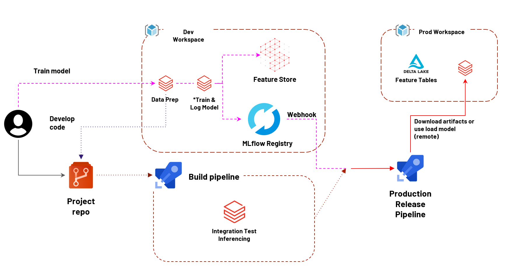

# MLOps Pipeline Using Azure Databricks

In this repository I'll show you how to use Azure Databricks for development and training machine learning models including build a MLOps pipeline to serving them with CI/CD process.

The objective is to build an end-to-end project for developing, training, deploying and monitoring machine learning models using Azure Databricks including feature store and MLFlow, at the end we'll have a documentation of all important steps.

**Related Documents**
- [Azure Databricks Use Case Presentation to Data Scientists Team](3rd/azurebricks_presentation_dst.pdf) - The objective of this presentation was discussing concepts, strategies and tools to apply MLOps, reduce operational costs and time to delivery a model in production.
- 

**MLOps Architecture**

